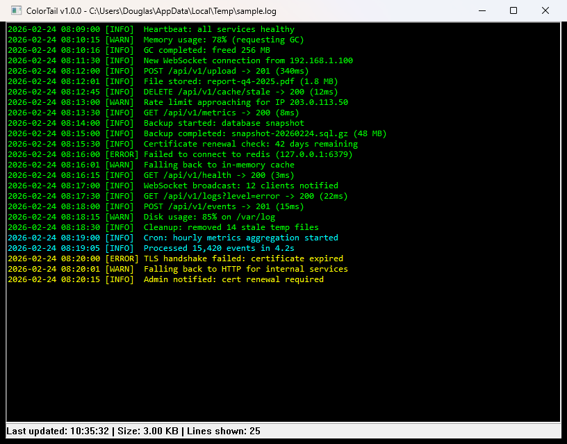

# ColorTail

A Windows GUI tail viewer that monitors a file in real-time with color-coded output. New lines are displayed in cycling colors so you can visually distinguish successive batches of output at a glance.




## Features

- Real-time file monitoring (1-second polling)
- 8-color cycling palette for new content batches
- Incremental updates — only new lines are appended
- Auto-scroll with manual scroll lock (stays put if you scroll up)
- Reads up to 16 MB tail for large files
- UTF-8 and ANSI encoding support
- File open dialog when launched without arguments

## Usage

```
ColorTail.exe <filepath> [lines]
```

| Argument | Description |
|----------|-------------|
| `filepath` | Path to the file to monitor |
| `lines` | Number of tail lines to display (default: 50) |

Double-click `ColorTail.exe` or run it with no arguments to open a file picker.

## Build

Requires CMake 3.15+ and a C++17 compiler (MinGW/GCC recommended).

```bash
cmake -B build -G Ninja
cmake --build build
```

Output: `build/ColorTail.exe`

## Installer

Requires [WiX Toolset v4](https://wixtoolset.org/).

```bash
cd installer
wix build Package.wxs -o ColorTail.msi
```

The MSI installs to Program Files, creates a Start Menu shortcut, and adds the install directory to PATH.
